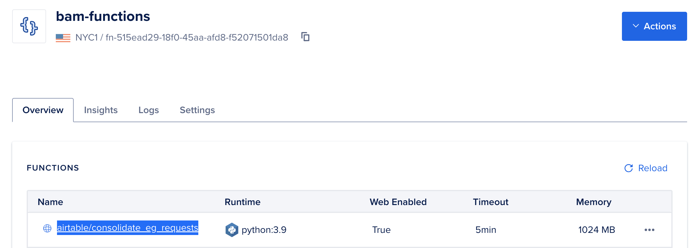
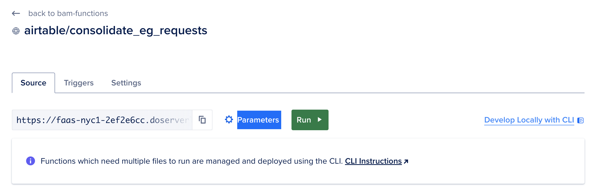
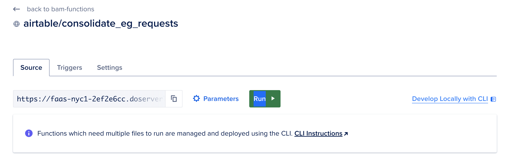

# About

This function is designed to help consolidate essential good requests to facilitate the scheduling of appointments before distros.  It performs the following operations:

Given:
  * an `ESSENTIAL_GOODS_REQUEST` item
    - eg `Jabón & Productos de baño / Soap & Shower Products / 肥皂和淋浴产品`.
    - You can view the full list of supported `ESSENTIAL_GOODS_REQUESTS` in [this file](../../../../core/bam_core/constants.py).
  * a `SOURCE_VIEW`, or the associated view of "open" requests for this item
    - eg `Essential Goods: Soap & Shower Products`
  * a list of `TARGET_VIEWS`, or other views of "open" requests
    - eg `["Essential Goods: Pads", "Essential Goods: Baby Diapers"]`

For each of the `TARGET_VIEWS`, find any phone numbers that are also in the `SOURCE_VIEW`. In the case that a matching record in the `TARGET_VIEW` has an `ESSENTIAL_GOODS_REQUEST` and the status is set to "timeout", delete the "timeout" status from the record in the `TARGET_VIEW` and add a "timeout" status to the record in the `SOURCE_VIEW`. In the case that a  matching record in the `TARGET_VIEW` does not have an `ESSENTIAL_GOODS_REQUEST`, add one so it opens a request for this item, and add a "timeout" flag to the record in the `SOURCE_VIEW`, thereby closing that request.

### To Run
##### Via DigitalOcean Console
1) If you don't already have access to BAM DigitalOcean account, request access in the BAM Tech signal chat
2) In the DigitalOcean dashboard: Click on Manage > Functions on the lefthand navigation bar, then select the `airtable/consolidate_eq_requests` function


3) Click on `Parameters`


4) Update the following input

```json
{
  "ESSENTIAL_GOODS_REQUEST": "Jabón & Productos de baño / Soap & Shower Products / 肥皂和淋浴产品",
  "SOURCE_VIEW": "Essential Goods: Soap & Shower Products",
  "TARGET_VIEWS": ["Essential Goods: Pads", "Essential Goods: Baby Diapers", "Essential Goods: Adult Diapers", "Essential Goods: Clothing Requests"],
  "DRY_RUN": "this is optional. set to `true` when you just want to see the expected output without running updates"
}
```

> NOTE: in `TARGET_VIEWS`, the format should be as follows: `[ "LIST NAME 1", "LIST NAME 2", "LIST NAME 3"]`. Make sure to note the placement of the quotation marks, commas, and the square brackets (`[` + `]`)

5) Click the `run` button


6) In the logs you should see a full list of the changes made and a summary of all changes.

