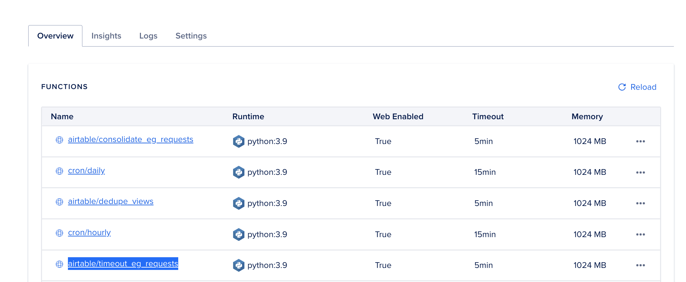
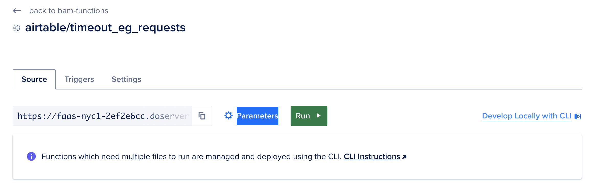
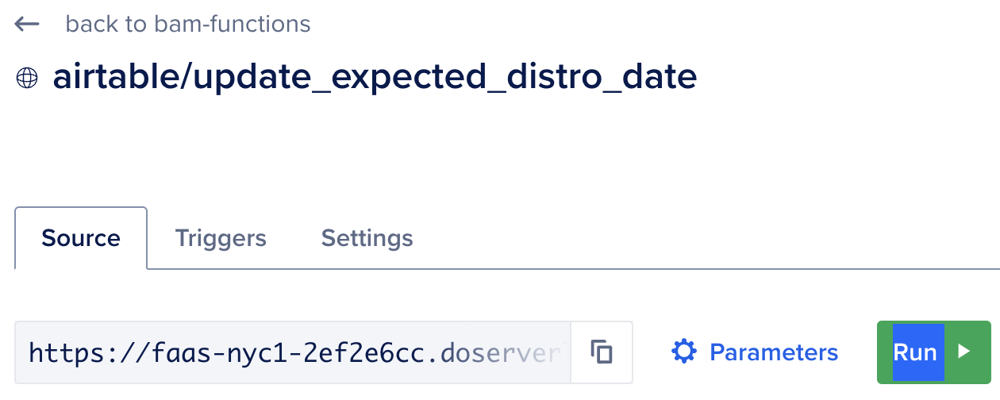

# About

This function accomplishes the following task:

- For all records that have an `ESSENTIAL_GOODS_REQUEST`, add a "timeout" status to any unfulfilled records for phone numbers which have at least one fulfilled request.

### To Run
##### Via DigitalOcean Console
1) If you don't already have access to BAM DigitalOcean account, request access in the BAM Tech signal chat
2) In the DigitalOcean dashboard: Click on Manage > Functions on the lefthand navigation bar, then select the `airtable/timeout_eq_requests` function


3) Click on `Parameters`


4) Update the following input

```json
{
  "ESSENTIAL_GOODS_REQUEST": "Jabón & Productos de baño / Soap & Shower Products / 肥皂和淋浴产品",
  "DRY_RUN": "this is optional. set to `true` when you just want to see the expected output without running updates"
}
```

5) Click the `Run` button


6) In the logs you should see a full list of the changes made and a summary of all changes.

