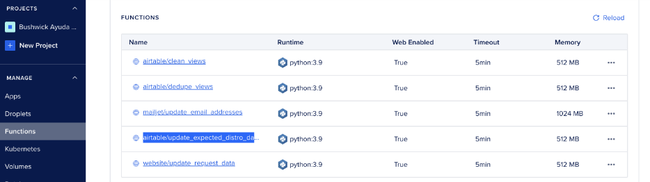
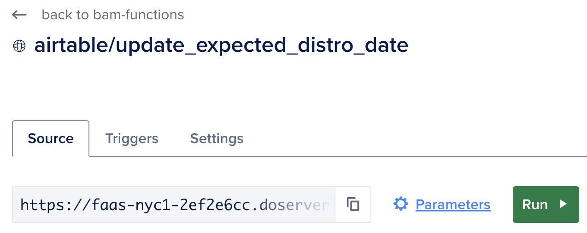
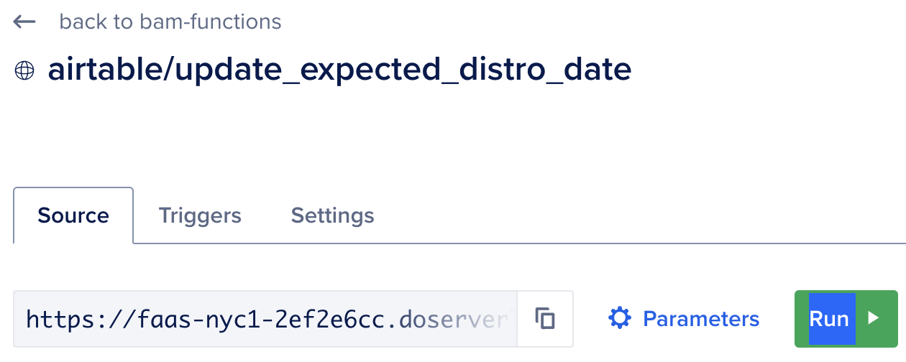
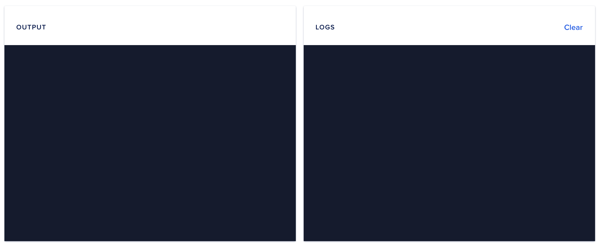

### To Run
##### Via DigitalOcean Console
0) If you don't already have access to BAM DigitalOcean account, request access in the BAM Tech signal chat
1) In the DigitalOcean dashboard: Click on Manage > Functions on the lefthand navigation bar, then select the `airtable/update_field_value` function


2) Click on `Parameters`


3) Update the following information
Note: You'll need to convert the doc text all into one line before copying it here (try pasting to [this site](https://www.textfixer.com/tools/paragraph-to-lines.php), clicking "convert to single line", then pasting into "PHONE_NUMBERS_TO_UPDATE")

```json
{
  "FIELD_NAME": "Expected EG Distribution Date",
  "NEW_VALUE": "2023-09-02",
  "PHONE_NUMBERS_TO_UPDATE": "copy doc txt here: blah blah blah phone number 123 456 7890 +10983248908",
  "VIEW_NAME": "this is optional. enter if you want to update only one view. otherwise set to an empty string",
  "DRY_RUN": "this is optional. set to `True` when you just want to see the expected output without running update"
}
```

1) Click the `run` button


1) To double check everything went ok, you should see the phone numbers, fields, and dates that were updated in the output/logs at the bottom of the function screen (and any errors, if they came up)


##### Via doctl
```
doctl serverless function invoke airtable/update_field_value -p NEW_VALUE:2023-09-03 -p PHONE_NUMBERS_TO_UPDATE:5162721795 -p FIELD_NAME:"Expected EG Distribution Date" --no-wait
```

### TODO
- Bulk update records
